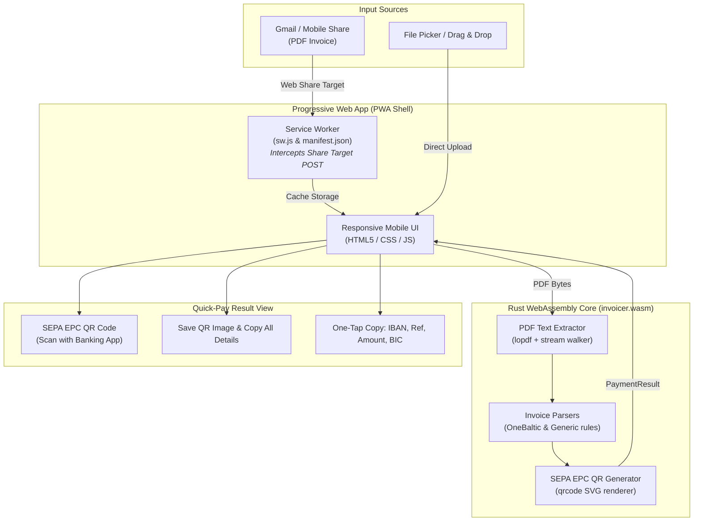

# Invoicer 🧾⚡

A privacy-first, offline **Progressive Web App (PWA)** built with a pure **Rust WebAssembly (Wasm)** engine. It parses PDF utility invoices on mobile and desktop, automatically extracting payment details and generating a standard **SEPA EPC QR Code (GiroCode)** for instant banking payments.

## 🌟 Key Features

* **⚡ 100% Client-Side WebAssembly**: Powered by Rust compiled to WebAssembly via `wasm-bindgen`. All PDF parsing and QR generation happen completely inside the browser runtime. Zero invoice data leaves your device.
* **📱 Android Share Target**: Installable as a PWA on Android. Share any invoice PDF directly from **Gmail** or your file manager straight to Invoicer!
* **📲 iOS & Desktop Support**: Tap or drag-and-drop any PDF invoice to parse instantly on iPhone, iPad, Mac, and PC.
* **🏧 Standard SEPA EPC QR Code (BCD v002)**: Generates a crisp vector QR code compatible with Revolut, Swedbank, SEB, Luminor, and all European banking apps.
* **📋 Quick-Action Transfers**:
  * **"Save QR Code Image"**: Save the QR code directly to scan or pick from photos in banking apps.
  * **"Copy All Transfer Details"**: Copy all fields (Beneficiary, IBAN, BIC, Amount, Reference) in one tap.
  * One-tap individual copy buttons for **IBAN**, **Payment Reference / Purpose**, **Amount**, and **BIC** with visual feedback.
* **🧠 Smart Multi-Template Parser**:
  * Specialized extractor for **OneBaltic Property Management SIA** invoices (extracts exact invoice number, OBI barcode reference `OBI/57559/127.43`, Industra Bank IBAN `LV97MULT1010A80170010`, BIC `MULTLV2X`, and total amount `Kopā apmaksai`).
  * Generic fallback heuristic parser for standard European invoices with IBAN, BIC, and EUR amounts.

## 🏗️ Architecture



## 🚀 Getting Started

### Prerequisites

* [Rust](https://rustup.rs/) (with `wasm32-unknown-unknown` target):
  ```bash
  rustup target add wasm32-unknown-unknown
  ```
* `wasm-bindgen-cli`:
  ```bash
  cargo install wasm-bindgen-cli --version 0.2.127
  ```
* [`just`](https://github.com/casey/just) command runner (optional, or run `./build.sh`)

### 🔨 Building the Project

Run with `just`:

```bash
just build
```

*Or via the shell script:*
```bash
./build.sh
```

### 🧪 Running Tests & Linting

Run the test suite:

```bash
just test
```

Run linter (`clippy` on native and wasm targets + `rustfmt` check):

```bash
just lint
```

Format codebase:

```bash
just fmt
```

### 🌐 Running Locally

Start a local static development web server:

```bash
just serve
```
*Or specify a custom port:*
```bash
just serve 8080
```

Open `http://localhost:3000` in your browser.

## 📲 How to Use on Your Phone

### On Android (with Gmail Share Target):
1. Open the hosted web app URL (HTTPS required for PWA service workers).
2. Tap the **Install** button in the header (or browser menu -> **"Add to Home Screen"**).
3. When you receive an invoice in **Gmail**, tap the attachment's **Share** icon and select **Invoicer**.
4. Invoicer opens instantly, parses the bill, and displays the SEPA EPC QR code with one-tap copy buttons and transfer details.

### On iPhone (iOS):
1. Open the app in Safari and tap **Share -> Add to Home Screen**.
2. Open the app and tap **"Choose Invoice PDF"** to pick your invoice.

